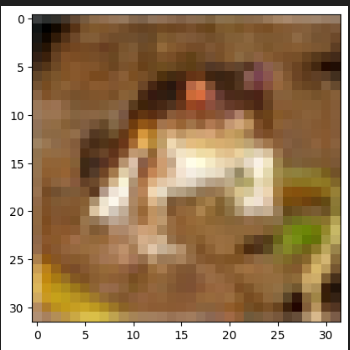
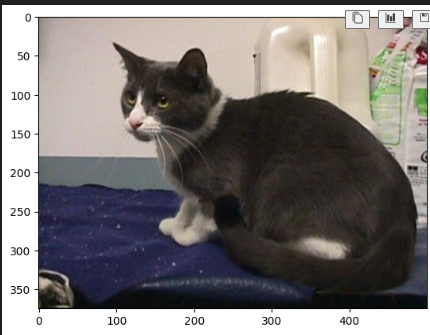
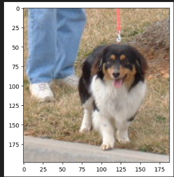
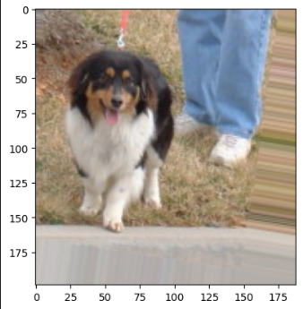
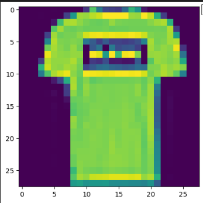
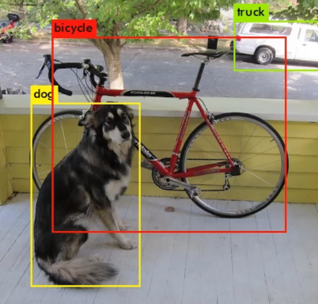

## Keras Convolution Neural Netowrk with MNIST
```Python
#loading MNIST dataset
from keras.datasets import mnist

# load MNIST data using tuple unpacking
(x_train, y_train), (x_test, y_test) = mnist.load_data()

# To see data we use matplot library
import matplotlib.pyplot as plt

# check the size of the data.
x_train.shape

# grab the single image from the first index
single_image = x_train[0]
single_image
```
Output:                                   
```Python
# Loading MNIST dataset
Downloading data from https://storage.googleapis.com/tensorflow/tf-keras-datasets/mnist.npz
11490434/11490434 ━━━━━━━━━━━━━━━━━━━━ 107s 9us/step

# size of the data, no color channel is there.
(60000, 28, 28)

# single image from the first index
array([[0., 0., 0., ..., 0., 0., 0.],
       [0., 0., 0., ..., 0., 0., 0.],
       [0., 0., 0., ..., 0., 0., 0.],
       ...,
       [0., 0., 0., ..., 0., 0., 0.],
```
```Python
plt.imshow(single_image, cmap='gray_r')
```
Output:                                         


```Python
y_train

y_train.shape
```
Output:                                         
```Python
# feeding the data in this format/category data in this way the network will not understand
array([5, 0, 4, ..., 5, 6, 8], dtype=uint8)

(60000,)
```

```Python
from keras.utils import to_categorical

# convert the labels into categorical data, 10 indicates number of category, need to encode the network can understand
y_train_categorical = to_categorical(y_train, 10)
y_test_categorical = to_categorical(y_test, 10)

y_test_categorical

# counting from first left side towards 0 at position 5 we have 1 which means number 5
y_train_categorical[0]

# processing x data, its not normalize, should normalize
single_image.max()

x_train = x_train / x_train.max() # same as dividing by /255

```
```Python
# y_test_categorical
array([[0., 0., 0., ..., 1., 0., 0.],
       [0., 0., 1., ..., 0., 0., 0.],
       [0., 1., 0., ..., 0., 0., 0.],
       ...,
       [0., 0., 0., ..., 0., 0., 0.],
       [0., 0., 0., ..., 0., 0., 0.],
       [0., 0., 0., ..., 0., 0., 0.]])

# y_train_categorical[0], works well with sigmoid function
 array([0., 0., 0., 0., 0., 1., 0., 0., 0., 0.])      

 # single_image.max() so the value is within 0 and 1. The value should be between 0 and 1, dividing by max value
 255.0
```

```Python
scaled_image = x_train[0]
scaled_image

scaled_image.max()

# showing image after scaling has no difference than first image.

```
```Python
# The values falls between 0 and 1

# scaled_image.max()
1.0
```
Output:                                             


```Python
# without color channel
x_train.shape

x_train = x_train.reshape(60000, 28, 28, 1)
x_train.shape

x_test = x_test.reshape(10000, 28, 28, 1)
x_test.shape
```
Output:                                             
```Python
(60000, 28, 28)

# x_train after reshaping
(60000, 28, 28, 1)

# x_test after reshaping
(10000, 28, 28, 1)
```
```Python
from keras.models import Sequential

# flatten outs 2D images
from keras.layers import Dense, Conv2D, Flatten, MaxPooling2D

# create model, creating sequencial onject
model = Sequential()

# CONVOLUTIONAL LAYERS
# for this images we can use 32 as difault filter otherwise for complex image we need to use higher filter size
model.add(Conv2D(filters = 32, kernel_size = (4,4),input_shape = (28, 28, 1), activation='relu'))

# POOLING LAYERS
model.add(MaxPooling2D(pool_size=(2,2)))

# converting Convolution and MAXPooling layers such that single dense layer can understand
model.add(Flatten()) # 2D------> 1D

# DENSE LAYERS
model.add((Dense(128, activation='relu'))) # fully connected layer, experiment with 128 values

model.add(Dense(10, activation='softmax')) # output layer, 10 is difault value for 10 digits

model.compile(loss='categorical_crossentropy', optimizer='rmsprop', metrics=['accuracy'])

model.summary()


model.fit(x_train, y_train_categorical, epochs=10)

# grab and evaluate the model
model.metrics_names
```
Output:   
# summary                                           


```Python
# epoch 
Epoch 1/10
1875/1875 ━━━━━━━━━━━━━━━━━━━━ 37s 18ms/step - accuracy: 0.9159 - loss: 0.2770
Epoch 2/10
1875/1875 ━━━━━━━━━━━━━━━━━━━━ 26s 14ms/step - accuracy: 0.9852 - loss: 0.0501
Epoch 3/10
1875/1875 ━━━━━━━━━━━━━━━━━━━━ 20s 11ms/step - accuracy: 0.9907 - loss: 0.0313
Epoch 4/10
1875/1875 ━━━━━━━━━━━━━━━━━━━━ 21s 11ms/step - accuracy: 0.9936 - loss: 0.0197
Epoch 5/10
1875/1875 ━━━━━━━━━━━━━━━━━━━━ 21s 11ms/step - accuracy: 0.9951 - loss: 0.0152
Epoch 6/10
1875/1875 ━━━━━━━━━━━━━━━━━━━━ 21s 11ms/step - accuracy: 0.9970 - loss: 0.0099
Epoch 7/10
1875/1875 ━━━━━━━━━━━━━━━━━━━━ 21s 11ms/step - accuracy: 0.9974 - loss: 0.0080
Epoch 8/10
1875/1875 ━━━━━━━━━━━━━━━━━━━━ 22s 11ms/step - accuracy: 0.9984 - loss: 0.0054
Epoch 9/10
1875/1875 ━━━━━━━━━━━━━━━━━━━━ 22s 12ms/step - accuracy: 0.9988 - loss: 0.0043
Epoch 10/10
1875/1875 ━━━━━━━━━━━━━━━━━━━━ 22s 12ms/step - accuracy: 0.9990 - loss: 0.0033
<keras.src.callbacks.history.History at 0x25f3bf58950>

# output of grab and evaluate the model
['loss', 'compile_metrics']
```
```Python
# Evaluating on test data and its able to predict 98% accurately in test data.
model.evaluate(x_test, y_test_categorical)

#predict class using images not seen by model before
from sklearn.metrics import classification_report

predictions = model.predict(x_test)

y_test_categorical

predictions

y_test

# cannot compare two datasets of differet types so converting to one format
import numpy as np

# Convert the probabilities to class labels
predicted_classes = np.argmax(predictions, axis=1)

# Now you can use 'predicted_classes' with 'y_test' in your classification report
from sklearn.metrics import classification_report
print(classification_report(y_test, predicted_classes))
```
Output:                                 
```Python
# if the model is performing good with training data and bad with test data, its due to overfitting of the data.
313/313 ━━━━━━━━━━━━━━━━━━━━ 1s 4ms/step - accuracy: 0.9863 - loss: 0.0638
[0.05277801677584648, 0.9887999892234802]


#y_test class
array([[0., 0., 0., ..., 1., 0., 0.],
       [0., 0., 1., ..., 0., 0., 0.],
       [0., 1., 0., ..., 0., 0., 0.],
       ...,
       [0., 0., 0., ..., 0., 0., 0.],
       [0., 0., 0., ..., 0., 0., 0.],
       [0., 0., 0., ..., 0., 0., 0.]])

 # predictions
 array([[9.2297792e-15, 1.7292027e-16, 7.4872232e-13, ..., 1.0000000e+00,
        2.2998750e-16, 8.1549677e-11],
       [2.2477912e-15, 4.2502259e-11, 1.0000000e+00, ..., 3.1703617e-25,
        9.9039379e-19, 1.1312233e-21],
       [5.0093959e-14, 1.0000000e+00, 3.0431819e-15, ..., 1.5723017e-13,
        1.9121931e-11, 4.0552490e-17],
       ...,
       [8.6883109e-25, 7.8078731e-14, 9.1847099e-24, ..., 8.3248919e-14,
        1.0957316e-13, 1.3460309e-13],
       [1.3640056e-21, 1.1529276e-21, 8.8102166e-28, ..., 2.4160694e-21,
        4.9079452e-10, 4.0378555e-23],
       [5.1946228e-17, 3.4413247e-20, 4.0085958e-19, ..., 2.1400377e-28,
        1.2465031e-20, 4.5787739e-22]], dtype=float32)

#y_test
array([7, 2, 1, ..., 4, 5, 6], dtype=uint8)

 precision    recall  f1-score   support

           0       0.98      0.99      0.99       980
           1       0.99      1.00      0.99      1135
           2       0.99      0.98      0.99      1032
           3       1.00      0.99      0.99      1010
           4       0.99      0.99      0.99       982
           5       0.99      0.99      0.99       892
           6       0.98      0.99      0.98       958
           7       1.00      0.98      0.99      1028
           8       0.98      0.99      0.99       974
           9       0.98      0.98      0.98      1009

    accuracy                           0.99     10000
   macro avg       0.99      0.99      0.99     10000
weighted avg       0.99      0.99      0.99     10000

```
## Keras Convolution Neural Netowrk with CIFAR-10, COLOR IMAGES
```Python
from keras.datasets import cifar10

# loead data, using tuple upacking
(x_train, y_train), (x_test, y_test) = cifar10.load_data()

# x_train.shape
x_train.shape

# x train data at position 0
x_train[0]

# x_train data shape
x_train.shape
```
Output:                                         
```Python
Downloading data from https://www.cs.toronto.edu/~kriz/cifar-10-python.tar.gz
170498071/170498071 ━━━━━━━━━━━━━━━━━━━━ 8635s 51us/step

# x_train.shape
(50000, 32, 32, 3)

# x_train data at position 0
array([[[ 59,  62,  63],
        [ 43,  46,  45],
        [ 50,  48,  43],
        ...,
        [158, 132, 108],
        [152, 125, 102],
        [148, 124, 103]],

       [[ 16,  20,  20],
        [  0,   0,   0],
        [ 18,   8,   0],
        ...,
        [123,  88,  55],
        [119,  83,  50],
        [122,  87,  57]],

       [[ 25,  24,  21],
        [ 16,   7,   0],
        [ 49,  27,   8],
        ...,
        [118,  84,  50],
        [120,  84,  50],
        [109,  73,  42]],

       ...,
...
        [179, 142,  87],
        ...,
        [216, 184, 140],
        [151, 118,  84],
        [123,  92,  72]]], dtype=uint8)

# x_train data shape
(50000, 32, 32, 3)
```
```Python
import matplotlib.pyplot as plt
plt.imshow(x_train[0])

# pre processing
x_train.max()

x_train = x_train / x_train.max() # same as dividing by /255
x_test = x_test / x_test.max() # same as dividing by /255

x_test.shape

# y_train is in integer format need to do One_hot encoding
y_train

from keras.utils import to_categorical
y_train_categorical = to_categorical(y_train, 10)
y_test_categorical = to_categorical(y_test, 10)
```
Output:                       


```Python
# pre processing
255

# x_test
(10000, 32, 32, 3)

#y_train data
array([[6],
       [9],
       [9],
       ...,
       [9],
       [1],
       [1]], dtype=uint8)
```
```Python
# Build our model
from keras.models import Sequential
from keras.layers import Conv2D, MaxPooling2D, Flatten, Dense

model = Sequential()

# CONVOLUTIONAL LAYERS
model.add(Conv2D(filters = 32, kernel_size = (4,4), input_shape = (32, 32, 3), activation='relu'))

model.add(MaxPooling2D(pool_size=(2,2)))

# CONVOLUTION LAYERS, the image is complex so another convolution layer is good idea
model.add(Conv2D(filters = 32, kernel_size = (4,4), input_shape = (32, 32, 3), activation='relu'))

model.add(MaxPooling2D(pool_size=(2,2)))

model.add(Flatten()) # 2D------> 1D

# DENSE LAYERS
model.add(Dense(256, activation='relu')) # fully connected layer, experiment with 128 values

model.add(Dense(10, activation='softmax')) # output layer, 10 is difault value for 10 digits

model.compile(loss='categorical_crossentropy', optimizer='rmsprop', metrics=['accuracy'])

model.summary()
```
Output:                               
```Python
**┏━━━━━━━━━━━━━━━━━━━━━━━━━━━━━━━━━┳━━━━━━━━━━━━━━━━━━━━━━━━┳━━━━━━━━━━━━━━━┓
┃ Layer (type)                    ┃ Output Shape           ┃       Param # ┃
┡━━━━━━━━━━━━━━━━━━━━━━━━━━━━━━━━━╇━━━━━━━━━━━━━━━━━━━━━━━━╇━━━━━━━━━━━━━━━┩
│ conv2d_2 (Conv2D)               │ (None, 29, 29, 32)     │         1,568 │
├─────────────────────────────────┼────────────────────────┼───────────────┤
│ max_pooling2d_2 (MaxPooling2D)  │ (None, 14, 14, 32)     │             0 │
├─────────────────────────────────┼────────────────────────┼───────────────┤
│ conv2d_3 (Conv2D)               │ (None, 11, 11, 32)     │        16,416 │
├─────────────────────────────────┼────────────────────────┼───────────────┤
│ max_pooling2d_3 (MaxPooling2D)  │ (None, 5, 5, 32)       │             0 │
├─────────────────────────────────┼────────────────────────┼───────────────┤
│ flatten_2 (Flatten)             │ (None, 800)            │             0 │
├─────────────────────────────────┼────────────────────────┼───────────────┤
│ dense_4 (Dense)                 │ (None, 256)            │       205,056 │
├─────────────────────────────────┼────────────────────────┼───────────────┤
│ dense_5 (Dense)                 │ (None, 10)             │         2,570 │
└─────────────────────────────────┴────────────────────────┴───────────────┘
 Total params: 225,610 (881.29 KB)
 Trainable params: 225,610 (881.29 KB)
 Non-trainable params: 0 (0.00 B)
```
```Python
model.fit(x_train, y_train_categorical, verbose = 1, epochs=10)

# evaluate our model
model.metrics_names

# evaluate our model
model.evaluate(x_test, y_test_categorical)

import numpy as np

# Convert the probabilities to class labels
predicted_classes = np.argmax(predictions, axis=1)

# Now you can use 'predicted_classes' with 'y_test' in your classification report
from sklearn.metrics import classification_report
print(classification_report(y_test, predicted_classes))
```
Output:                                           
```Python
#epochs
Epoch 1/10
1563/1563 ━━━━━━━━━━━━━━━━━━━━ 30s 17ms/step - accuracy: 0.3663 - loss: 1.7403
Epoch 2/10
1563/1563 ━━━━━━━━━━━━━━━━━━━━ 29s 19ms/step - accuracy: 0.5754 - loss: 1.1998
Epoch 3/10
1563/1563 ━━━━━━━━━━━━━━━━━━━━ 33s 21ms/step - accuracy: 0.6462 - loss: 1.0162
Epoch 4/10
1563/1563 ━━━━━━━━━━━━━━━━━━━━ 33s 21ms/step - accuracy: 0.6925 - loss: 0.8861
Epoch 5/10
1563/1563 ━━━━━━━━━━━━━━━━━━━━ 31s 20ms/step - accuracy: 0.7249 - loss: 0.8090
Epoch 6/10
1563/1563 ━━━━━━━━━━━━━━━━━━━━ 33s 21ms/step - accuracy: 0.7497 - loss: 0.7347
Epoch 7/10
1563/1563 ━━━━━━━━━━━━━━━━━━━━ 31s 20ms/step - accuracy: 0.7694 - loss: 0.6799
Epoch 8/10
1563/1563 ━━━━━━━━━━━━━━━━━━━━ 29s 19ms/step - accuracy: 0.7818 - loss: 0.6256
Epoch 9/10
1563/1563 ━━━━━━━━━━━━━━━━━━━━ 27s 17ms/step - accuracy: 0.8066 - loss: 0.5760
Epoch 10/10
1563/1563 ━━━━━━━━━━━━━━━━━━━━ 31s 20ms/step - accuracy: 0.8209 - loss: 0.5295
<keras.src.callbacks.history.History at 0x25f6a250350>

# evaluate our model
['loss', 'compile_metrics']

# evaluated model with 62% accuracy
313/313 ━━━━━━━━━━━━━━━━━━━━ 4s 11ms/step - accuracy: 0.6261 - loss: 1.2425
[1.2423770427703857, 0.6243000030517578]

#evaluation
              precision    recall  f1-score   support

           0       0.62      0.74      0.68      1000
           1       0.57      0.85      0.68      1000
           2       0.70      0.36      0.48      1000
           3       0.55      0.26      0.35      1000
           4       0.57      0.63      0.60      1000
           5       0.53      0.60      0.56      1000
           6       0.66      0.76      0.71      1000
           7       0.79      0.65      0.71      1000
           8       0.59      0.84      0.69      1000
           9       0.77      0.56      0.65      1000

    accuracy                           0.62     10000
   macro avg       0.64      0.62      0.61     10000
weighted avg       0.64      0.62      0.61     10000
```

# Python for Computer Vision with OpenCV and Deep Learning

When ever building our own model we should have folder containing train and test data with different classes in each folder/should have each category of data.

```Python
import cv2
import matplotlib.pyplot as plt

cat_img = cv2.imread('P:/Pi OpenCV  programming/CATS_DOGS/CATS_DOGS/train/CAT/4.jpg')
cat_img = cv2.cvtColor(cat_img, cv2.COLOR_BGR2RGB)

plt.imshow(cat_img)

#shape of the image
cat_img.shape
```
Output:                                           


```Python
#shape of the image
(375, 500, 3)
```
Loading dog image
```Python
dog_img = cv2.imread('P:/Pi OpenCV  programming/CATS_DOGS/CATS_DOGS/train/DOG/2.jpg')
dog_img = cv2.cvtColor(dog_img, cv2.COLOR_BGR2RGB)

plt.imshow(dog_img)

dog_img.shape
```

Output:                                           


Size of dog image and cat image are not same. In the real word its not possible to get image of the same size, therefore, need to prepare data and keras has imagedatagenerator function. Also need to do transformation like rotate the image.
```Python
(199, 188, 3)
```
```Python
from keras.src.legacy.preprocessing.image import ImageDataGenerator

image_gen = ImageDataGenerator(
    rotation_range=30,
    width_shift_range=0.1,
    height_shift_range=0.1,  # Corrected typo here
    rescale=1./255,
    shear_range=0.2,
    zoom_range=0.2,
    horizontal_flip=True,
    fill_mode='nearest'
)
plt.imshow(image_gen.random_transform(dog_img))
```
Output:                                                 


```Python
image_gen.flow_from_directory('P:/Pi OpenCV  programming/CATS_DOGS/CATS_DOGS/train')

model = Sequential()

model.add(Conv2D(filters = 32, kernel_size = (3, 3), activation='relu', input_shape=(150, 150, 3)))
model.add(MaxPooling2D(pool_size=(2, 2)))

model.add(Conv2D(filters = 64, kernel_size = (3, 3), activation='relu', input_shape=(150, 150, 3)))
model.add(MaxPooling2D(pool_size=(2, 2)))

model.add(Conv2D(filters = 64, kernel_size = (3, 3), activation='relu', input_shape=(150, 150, 3)))
model.add(MaxPooling2D(pool_size=(2, 2)))

model.add(Flatten())

model.add(Dense(units=128, activation='relu'))

# drop out helps over fitting by randomly turning off some neurons
model.add(Dropout(0.5))

model.add(Dense(units=1))
model.add(Activation('sigmoid'))

model.compile(loss='binary_crossentropy',
              optimizer='adam',
              metrics=['accuracy'])

# model summery

```
Output:                                                 
```Python
Found 18743 images belonging to 2 classes.
<keras.src.legacy.preprocessing.image.DirectoryIterator at 0x20279417450>

Model: "sequential_5"

┃ Layer (type)                    ┃ Output Shape           ┃       Param # ┃
┡━━━━━━━━━━━━━━━━━━━━━━━━━━━━━━━━━╇━━━━━━━━━━━━━━━━━━━━━━━━╇━━━━━━━━━━━━━━━┩
│ conv2d (Conv2D)                 │ (None, 148, 148, 32)   │           896 │
├─────────────────────────────────┼────────────────────────┼───────────────┤
│ max_pooling2d (MaxPooling2D)    │ (None, 74, 74, 32)     │             0 │
├─────────────────────────────────┼────────────────────────┼───────────────┤
│ conv2d_1 (Conv2D)               │ (None, 72, 72, 64)     │        18,496 │
├─────────────────────────────────┼────────────────────────┼───────────────┤
│ max_pooling2d_1 (MaxPooling2D)  │ (None, 36, 36, 64)     │             0 │
├─────────────────────────────────┼────────────────────────┼───────────────┤
│ conv2d_2 (Conv2D)               │ (None, 34, 34, 64)     │        36,928 │
├─────────────────────────────────┼────────────────────────┼───────────────┤
│ max_pooling2d_2 (MaxPooling2D)  │ (None, 17, 17, 64)     │             0 │
├─────────────────────────────────┼────────────────────────┼───────────────┤
│ flatten (Flatten)               │ (None, 18496)          │             0 │
├─────────────────────────────────┼────────────────────────┼───────────────┤
│ dense (Dense)                   │ (None, 128)            │     2,367,616 │
├─────────────────────────────────┼────────────────────────┼───────────────┤
│ dropout (Dropout)               │ (None, 128)            │             0 │
├─────────────────────────────────┼────────────────────────┼───────────────┤
│ dense_1 (Dense)                 │ (None, 1)              │           129 │
├─────────────────────────────────┼────────────────────────┼───────────────┤
│ activation (Activation)         │ (None, 1)              │             0 │
└─────────────────────────────────┴────────────────────────┴───────────────┘

Total params: 2,424,065 (9.25 MB)
 Trainable params: 2,424,065 (9.25 MB)
 Non-trainable params: 0 (0.00 B)
```

```Python


# create image training generation object for both training and testing, choose batch size
batch_size = 16

train_datagen = image_gen.flow_from_directory('P:/Pi OpenCV  programming/CATS_DOGS/CATS_DOGS/train', 
target_size = input_shape[:2],
batch_size = batch_size,
class_mode = 'binary')

# create image training generation object for both training and testing, choose batch size
batch_size = 16

test_datagen = image_gen.flow_from_directory('P:/Pi OpenCV  programming/CATS_DOGS/CATS_DOGS/test', 
target_size = input_shape[:2],
batch_size = batch_size,
class_mode = 'binary')
```
Output:                                   
```Python
# gives number of images found and number of classes.
Found 18743 images belonging to 2 classes.

# testing data
Found 6251 images belonging to 2 classes.

```
```Python
# defines what image belongs to which class
train_datagen.class_indices

# if you dont want to see warning use the code
import warnings
warnings.filterwarnings('ignore')

results = model.fit(
    train_datagen, 
    epochs=1, 
    steps_per_epoch=150, 
    validation_data=test_datagen, 
    validation_steps=12
)

# saving model
model.save('my_model.h5')  # HDF5 format


# checking historical accuracy
results.history['accuracy']

# loading my model
from keras.models import load_model
new_model = load_model('my_model.h5')


dog_file = 'P:/Pi OpenCV  programming/CATS_DOGS/CATS_DOGS/train/DOG/1005.jpg'

from keras.preprocessing import image

dog_img = image.load_img(dog_file, target_size=(150, 150))

dog_img = image.img_to_array(dog_img)


dog_img.shape
```
```Python
{'CAT': 0, 'DOG': 1}

# 1 epoch training result, worning suggesting some images are unable to read
c:\Python311\Lib\site-packages\keras\src\trainers\data_adapters\py_dataset_adapter.py:120: UserWarning: Your `PyDataset` class should call `super().__init__(**kwargs)` in its constructor. `**kwargs` can include `workers`, `use_multiprocessing`, `max_queue_size`. Do not pass these arguments to `fit()`, as they will be ignored.
  self._warn_if_super_not_called()
150/150 ━━━━━━━━━━━━━━━━━━━━ 59s 373ms/step - accuracy: 0.5028 - loss: 0.7161 - val_accuracy: 0.5260 - val_loss: 0.6906

[0.5116666555404663]

(150, 150, 3)
```
```Python
# the network will think that the image 150 by 150 is batch of one image so have to expand
import numpy as np
dog_img = np.expand_dims(dog_img, axis=0)
dog_img.shape

# all the image value to be between 0 and 1
dog_img = dog_img/255.0

model.predict(dog_img)
```
```Python
(1, 150, 150, 3)

# Not able to predict correctly as its run on one epoch, suggesting 48% the image is dog
1/1 ━━━━━━━━━━━━━━━━━━━━ 0s 191ms/step
array([[0.48901746]], dtype=float32)
```
## Deep Learning and CNN Assessment Solution
```Python
from keras.datasets import fashion_mnist

(x_train, y_train), (x_test, y_test) = fashion_mnist.load_data()

import matplotlib.pyplot as plt

plt.imshow(x_train[1])

y_train[1]


# normalizing x train and x test
x_train = x_train/255
x_test = x_test/255

# include 4 dimensional single channel
x_train = x_train.reshape(60000, 28, 28, 1)
x_test = x_test.reshape(10000, 28, 28, 1)

# convet y_train and y_test to be one-hot encoded for categorical analysis by Keras
from keras.utils import to_categorical

y_train 

y_cat_train =to_categorical(y_train)

y_cat_test = to_categorical(y_test)
```
Output:                                          
```Python
Downloading data from https://storage.googleapis.com/tensorflow/tf-keras-datasets/train-labels-idx1-ubyte.gz
29515/29515 ━━━━━━━━━━━━━━━━━━━━ 0s 16us/step
Downloading data from https://storage.googleapis.com/tensorflow/tf-keras-datasets/train-images-idx3-ubyte.gz
26421880/26421880 ━━━━━━━━━━━━━━━━━━━━ 465s 18us/step
Downloading data from https://storage.googleapis.com/tensorflow/tf-keras-datasets/t10k-labels-idx1-ubyte.gz
5148/5148 ━━━━━━━━━━━━━━━━━━━━ 0s 17us/step
Downloading data from https://storage.googleapis.com/tensorflow/tf-keras-datasets/t10k-images-idx3-ubyte.gz
4422102/4422102 ━━━━━━━━━━━━━━━━━━━━ 64s 14us/step
```


Output:                                   
```Python
0

# y_train
array([9, 0, 0, ..., 3, 0, 5], dtype=uint8)
```
```Python
from keras.models import Sequential
from keras.layers import Dense, Conv2D, MaxPooling2D, Flatten

model = Sequential()

model.add(Conv2D(filters=32, kernel_size= (4, 4), activation='relu', input_shape=(28, 28, 1)))

model.add(MaxPooling2D(pool_size=(2, 2)))

model.add(Flatten())

model.add(Dense(units=128, activation='relu'))

model.add(Dense(units=10, activation='softmax'))

model.compile(loss='categorical_crossentropy',
              optimizer='rmsprop', 
              metrics=['accuracy'])
```
```Python
Model: "sequential_8"


 Layer (type)                    ┃ Output Shape           ┃       Param # ┃
┡━━━━━━━━━━━━━━━━━━━━━━━━━━━━━━━━━╇━━━━━━━━━━━━━━━━━━━━━━━━╇━━━━━━━━━━━━━━━┩
│ conv2d_5 (Conv2D)               │ (None, 25, 25, 32)     │           544 │
├─────────────────────────────────┼────────────────────────┼───────────────┤
│ max_pooling2d_5 (MaxPooling2D)  │ (None, 12, 12, 32)     │             0 │
├─────────────────────────────────┼────────────────────────┼───────────────┤
│ flatten_3 (Flatten)             │ (None, 4608)           │             0 │
├─────────────────────────────────┼────────────────────────┼───────────────┤
│ dense_6 (Dense)                 │ (None, 128)            │       589,952 │
├─────────────────────────────────┼────────────────────────┼───────────────┤
│ dense_7 (Dense)                 │ (None, 10)             │         1,290 │
└─────────────────────────────────┴────────────────────────┴───────────────┘

 Total params: 591,786 (2.26 MB)
 Trainable params: 591,786 (2.26 MB)
 Non-trainable params: 0 (0.00 B)
```
```Python
# train and fit the model
model.fit(x_train, y_cat_train, epochs=10)

# evaluate our model
model.evaluate(x_test, y_cat_test)

model.metrics_names
```
```Python
Epoch 1/10
1875/1875 ━━━━━━━━━━━━━━━━━━━━ 21s 11ms/step - accuracy: 0.8067 - loss: 0.5422
Epoch 2/10
1875/1875 ━━━━━━━━━━━━━━━━━━━━ 19s 10ms/step - accuracy: 0.8947 - loss: 0.2862
Epoch 3/10
1875/1875 ━━━━━━━━━━━━━━━━━━━━ 19s 10ms/step - accuracy: 0.9141 - loss: 0.2375
Epoch 4/10
1875/1875 ━━━━━━━━━━━━━━━━━━━━ 19s 10ms/step - accuracy: 0.9255 - loss: 0.2053
Epoch 5/10
1875/1875 ━━━━━━━━━━━━━━━━━━━━ 19s 10ms/step - accuracy: 0.9328 - loss: 0.1808
Epoch 6/10
1875/1875 ━━━━━━━━━━━━━━━━━━━━ 19s 10ms/step - accuracy: 0.9403 - loss: 0.1617
Epoch 7/10
1875/1875 ━━━━━━━━━━━━━━━━━━━━ 19s 10ms/step - accuracy: 0.9482 - loss: 0.1469
Epoch 8/10
1875/1875 ━━━━━━━━━━━━━━━━━━━━ 19s 10ms/step - accuracy: 0.9503 - loss: 0.1359
Epoch 9/10
1875/1875 ━━━━━━━━━━━━━━━━━━━━ 19s 10ms/step - accuracy: 0.9570 - loss: 0.1209
Epoch 10/10
1875/1875 ━━━━━━━━━━━━━━━━━━━━ 19s 10ms/step - accuracy: 0.9594 - loss: 0.1129
<keras.src.callbacks.history.History at 0x202041ca3d0>

# evaluateing model
313/313 ━━━━━━━━━━━━━━━━━━━━ 1s 3ms/step - accuracy: 0.9026 - loss: 0.3396
[0.3162655234336853, 0.9042999744415283]
```
```Python
# perfrom prediction
from sklearn.metrics import classification_report

predictions = model.predict(x_test)

print(classification_report(y_test, predictions.argmax(axis=1)))
```
```Python
313/313 ━━━━━━━━━━━━━━━━━━━━ 1s 3ms/step
              precision    recall  f1-score   support

           0       0.81      0.89      0.85      1000
           1       0.98      0.98      0.98      1000
           2       0.80      0.87      0.84      1000
           3       0.90      0.90      0.90      1000
           4       0.88      0.79      0.83      1000
           5       0.98      0.98      0.98      1000
           6       0.78      0.70      0.74      1000
           7       0.97      0.97      0.97      1000
           8       0.98      0.98      0.98      1000
           9       0.97      0.97      0.97      1000

    accuracy                           0.90     10000
   macro avg       0.90      0.90      0.90     10000
weighted avg       0.90      0.90      0.90     10000
```

## Introduction to YOLO V3
Image detection algorithm
YOLO view image and draw bounding boxes over what it preceives as identified classes.


YOLO apply single neural network to the full image. This network divides the image into regions and predicts bounding boxes and class probabilities for each region. These bounding boxes are weighted by the predicted probabilities.1000x Faster than RCNN and 100x faster than fast R-CNN.

```Python
# Bunch of imports
import os
import time
import cv2
import numpy as np
from model.yolo_model import YOLO

# image process function will resize, reduce, and expand image based on original image
def process_image(img):
    """Resize, reduce and expand image.

    # Argument:
        img: original image.

    # Returns
        image: ndarray(64, 64, 3), processed image.
    """
    image = cv2.resize(img, (416, 416),
                       interpolation=cv2.INTER_CUBIC)
    image = np.array(image, dtype='float32')
    image /= 255.
    image = np.expand_dims(image, axis=0)

    return image

# this function will grab the classes from coco_classes.txt file
def get_classes(file):
    """Get classes name.

    # Argument:
        file: classes name for database.

    # Returns
        class_names: List, classes name.

    """
    with open(file) as f:
        class_names = f.readlines()
    class_names = [c.strip() for c in class_names]

    return class_names

# this function will draw the bounding boxes using cv2 and also defines percentage that the identified class is of the that particular classes.
def draw(image, boxes, scores, classes, all_classes):
    """Draw the boxes on the image.

    # Argument:
        image: original image.
        boxes: ndarray, boxes of objects.
        classes: ndarray, classes of objects.
        scores: ndarray, scores of objects.
        all_classes: all classes name.
    """
    for box, score, cl in zip(boxes, scores, classes):
        x, y, w, h = box

        top = max(0, np.floor(x + 0.5).astype(int))
        left = max(0, np.floor(y + 0.5).astype(int))
        right = min(image.shape[1], np.floor(x + w + 0.5).astype(int))
        bottom = min(image.shape[0], np.floor(y + h + 0.5).astype(int))

        cv2.rectangle(image, (top, left), (right, bottom), (255, 0, 0), 2)
        cv2.putText(image, '{0} {1:.2f}'.format(all_classes[cl], score),
                    (top, left - 6),
                    cv2.FONT_HERSHEY_SIMPLEX,
                    0.6, (0, 0, 255), 1,
                    cv2.LINE_AA)

        print('class: {0}, score: {1:.2f}'.format(all_classes[cl], score))
        print('box coordinate x,y,w,h: {0}'.format(box))

    print()

# this function will take the image and the model and will return the image with the bounding boxes drawn on it.
def detect_image(image, yolo, all_classes):
    """Use yolo v3 to detect images.

    # Argument:
        image: original image.
        yolo: YOLO, yolo model.
        all_classes: all classes name.

    # Returns:
        image: processed image.
    """
    pimage = process_image(image)

    start = time.time()
    boxes, classes, scores = yolo.predict(pimage, image.shape)
    end = time.time()

    print('time: {0:.2f}s'.format(end - start))

    if boxes is not None:
        draw(image, boxes, scores, classes, all_classes)

    return image

# this function will detect object or class using video
def detect_video(video, yolo, all_classes):
    """Use yolo v3 to detect video.

    # Argument:
        video: video file.
        yolo: YOLO, yolo model.
        all_classes: all classes name.
    """
    video_path = os.path.join("videos", "test", video)
    camera = cv2.VideoCapture(video_path)
    cv2.namedWindow("detection", cv2.WINDOW_AUTOSIZE)

    # Prepare for saving the detected video
    sz = (int(camera.get(cv2.CAP_PROP_FRAME_WIDTH)),
        int(camera.get(cv2.CAP_PROP_FRAME_HEIGHT)))
    fourcc = cv2.VideoWriter_fourcc(*'mpeg')

    
    vout = cv2.VideoWriter()
    vout.open(os.path.join("videos", "res", video), fourcc, 20, sz, True)

    while True:
        res, frame = camera.read()

        if not res:
            break

        image = detect_image(frame, yolo, all_classes)
        cv2.imshow("detection", image)

        # Save the video frame by frame
        vout.write(image)

        if cv2.waitKey(110) & 0xff == 27:
                break

    vout.release()
    camera.release()

# create instance of the YOLO
yolo = YOLO(0.6, 0.5)
file = 'data/coco_classes.txt'
all_classes = get_classes(file)   

# detect image 
f = 'jingxiang-gao-489454-unsplash.jpg'
path = 'images/'+f
image = cv2.imread(path)
image = detect_image(image, yolo, all_classes)
cv2.imwrite('images/res/' + f, image)

# detect video
etect videos one at a time in videos/test folder    
video = 'library1.mp4'
detect_video(video, yolo, all_classes)
```
[Click Here](https://github.com/Ashleshk/Computer-Vision-with-Python-Udemy/blob/master/06-YOLOv3/06-YOLO-Object-Detection.ipynb)

