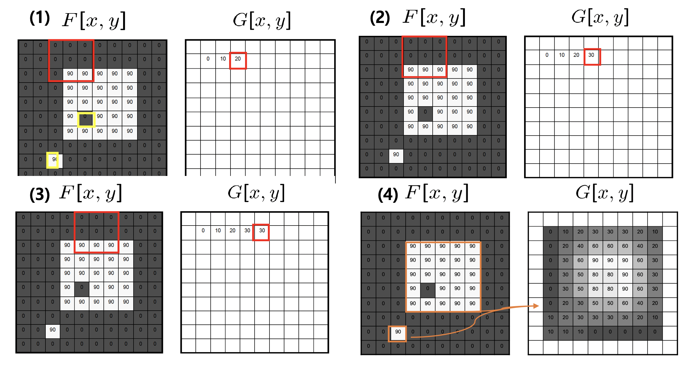
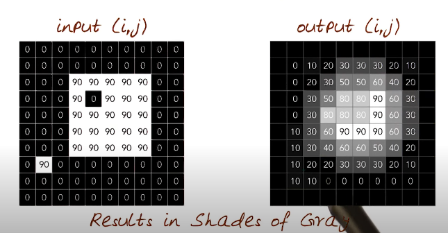
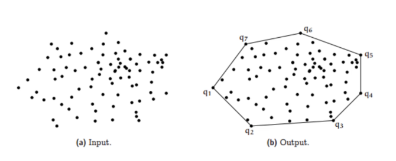
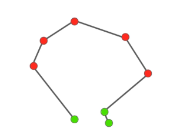
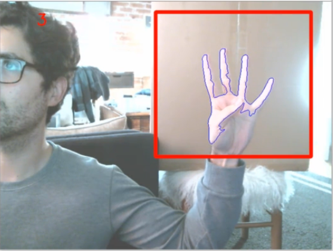

# Section 9. CAPSTONE PROJECT
## Capstone Part One -Variables and Background function

Average of image where placing 3 by 3 kernal on top of original image, find average and placed on the center of new image.



```Python
import cv2
import numpy as np

from sklearn.metrics import pairwise

# creat global variables   
background = None

accumulated_weight = 0.5

# creat ROI i.e. red bounding box
# corners of the rectangle
roi_top = 20
roi_bottom = 300
roi_right = 300
roi_left = 600

# #create function that will find average background value
def calc_accum_avg(frame, accumulated_weight):

    global background
    if background is None:
        background = frame.copy().astype("float")
        return None
    
# docstring src (Source Image), image must be 1-channel or 3-channel, 8-bit integer format or 32-bit floating-point format.
# dst stands for destination or output image/accumulated image
# The output image (dst) is updated continuously with each new image. This means that dst is always a representation of the average of all the images processed so far, adjusted by the weight each image has been given via the alpha parameter.  
# The parameter alpha determines how much weight the new image carries in this combination. A higher alpha value gives more importance to the latest image, making the running average more sensitive to recent changes. 
# Conversely, a lower alpha means that older images influence the running average more strongly, which results in a smoother, less reactive average.

    cv2.accumulateWeighted(frame, background, accumulated_weight)
```
## Finger Counting and ConvexHull
A convex hull draws a polygon by connecting points around points around the most external points in a frame.




```Python
def count_fingers(Thresholded, hand_segment):

    conv_hull = cv2.convexHull(hand_segment)

    # pass extreme points
    top = tuple(conv_hall[conv_hull[:,:,1].argmin()[0]])
    bottom = tuple(conv_hall[conv_hull[:,:,1].argmax()[0]])
    left = tuple(conv_hall[conv_hull[:,:,0].argmin()[0]])
    right = tuple(conv_hall[conv_hull[:,:,0].argmax()[0]])

# center of the hand will be half way between top and bottom and left and right
    cx = (left[0] + right[0]) // 2 # // to get integer value
    cy = (top[1] + bottom[1]) // 2

    distance = pairwise.euclidean_distances([(cx, cy)], Y=[left, right, top, bottom])[0]

    max_distance = distance.max()

    # radius of the circle will be the distance between the center of the hand and the extreme points
    radius = int(0.9 * max_distance) 
    circumference = (2 * np.pi * radius)

    circular_roi = np.zeros(Thresholded.shape[:2], dtype = "uint8")

    cv2.circle(circular_roi, (cx, cy), radius, 255, 10)

    # bitwise and of the thresholded image and the circular ROI
    circular_roi = cv2.bitwise_and(Thresholded, Thresholded, mask = circular_roi)

    # contours of the circular ROI
    image, contours, hierarchy = cv2.findContours(circular_roi.copy(), cv2.RETR_EXTERNAL, cv2.CHAIN_APPROX_NONE)

    count = 0
    
    for cnt in contours:

        (x, y, w, h) = cv2.boundingRect(cnt)

        # check some condition, if person has more had included in the bounding box will create lots of points
        out_of_wrist = (cy + (cy * 0.25)) > (y + h)

        # no. of points dose not exceed 0.25 percent
        limit_points = ((circumfrence * 0.25) > cnt.shape[0])

        if out_of_wrist and limit_points:
            count += 1

        return count

```
## Capstone Part Four - Bringing it all together
```Python
cam = cv2.VideoCapture(0)

# calculate background
num_frames = 0

while True:
    ret, frame = cam.read()

    frame_copy = frame.copy()

    roi = frame[roi_top:roi_bottom, roi_right:roi_left]

    gray = cv2.cvtColor(roi, cv2.COLOR_BGR2GRAY)

    gray = cv2.GaussianBlur(gray, (7, 7), 0)

    if num_frames < 60:
        calc_accum_avg(gray, accumulated_weight)

        if num_frames <= 59:
            cv2.putText(frame_copy, "FETCHING BACKGROUND...PLEASE WAIT", (200, 300), cv2.FONT_HERSHEY_SIMPLEX, 0.9, (0,0,255), 2)
            cv2.imshow('Fingure Count', frame_copy)
    else:
        hand = segment(gray)

        if hand is not None:
            (thresholded, hand_segment) = hand

            # Draws contours around real hand in live stream
            cv2.drawContours(frame_copy, [hand_segment + (roi_right, roi_top)], -1, (0, 0, 255), 5)

            fingers = count_fingers(thresholded, hand_segment)

            cv2.putText(frame_copy, str(fingers), (70, 50), cv2.FONT_HERSHEY_SIMPLEX, 1, (0,0,255), 2)

            cv2.imshow('Thresholded', thresholded)

cv2.rectangle(frame_copy, (roi_left, roi_top), (roi_right, roi_bottom), (0,255,0), 5)

num_frames += 1

cv2.imshow('Fingure Count', frame_copy)

k = cv2.waitKey(1) & 0xFF

if k == 27:
    break

cam.release()
cv2.destroyAllWindows
```
Output:                             



Python for Data Science and Machine Learning Bootcamp

https://www.udemy.com/course/python-for-data-science-and-machine-learning-bootcamp/?referralCode=F0207A94F3BB77D16B05 

Complete Tensorflow 2 and Keras Deep Learning Bootcamp
https://www.udemy.com/course/complete-tensorflow-2-and-keras-deep-learning-bootcamp/?referralCode=9D827667C4137097BA75 

Python and Django Full Stack Web Developer Bootcamp

https://www.udemy.com/course/python-and-django-full-stack-web-developer-bootcamp/?referralCode=16B59E19CDF0F6499DA9 

Data Science and Machine Learning Bootcamp with R

https://www.udemy.com/course/data-science-and-machine-learning-bootcamp-with-r/?referralCode=DD3BDE6A7363C5869FE4 

Data Science Career Guide - Interview Preparation

https://www.udemy.com/course/data-science-career-guide-interview-preparation/?referralCode=64BE6BF2BCD0D1055116 


Python for Financial Analysis and Algorithmic Trading

https://www.udemy.com/course/python-for-finance-and-trading-algorithms/?referralCode=C8C60DBE8BD424113FBA 

Spark and Python for Big Data with PySpark

https://www.udemy.com/course/spark-and-python-for-big-data-with-pyspark/?referralCode=017184CE9AC49F12B7E8 

Scala and Spark for Big Data and Machine Learning

https://www.udemy.com/course/scala-and-spark-for-big-data-and-machine-learning/?referralCode=B93E10EE3C7E502CABE8 


The Complete SQL Bootcamp

https://www.udemy.com/course/the-complete-sql-bootcamp/?referralCode=9CB278C5DD16C84B0BAA 

Complete Python Bootcamp: Go from zero to hero in Python

https://www.udemy.com/course/complete-python-bootcamp/?referralCode=9DDB5BAAD1D17300BC92 

Python for Data Structures, Algorithms, and Interviews! 

https://www.udemy.com/course/python-for-data-structures-algorithms-and-interviews/?referralCode=D044EFCB32C7A426D73C 

Interactive Python Dashboards with Plotly and Dash

https://www.udemy.com/course/interactive-python-dashboards-with-plotly-and-dash/?referralCode=6CC6F5CE75C93B892D12 

Python and Flask Bootcamp: Create Websites with Flask

https://www.udemy.com/course/python-and-flask-bootcamp-create-websites-using-flask/?referralCode=B9DE069F79B8D2080202

Python Masterclass Journey

https://www.udemy.com/course/complete-python-3-masterclass-journey/?referralCode=9B9CFAED0148FB8AA509 

Probability and Statistics for Business and Data Science

https://www.udemy.com/course/probability-and-statistics-for-business-and-data-science/?referralCode=74FCCE1C48A13FD765FB

Python for Computer Vision with OpenCV and Deep Learning

https://www.udemy.com/course/python-for-computer-vision-with-opencv-and-deep-learning/?referralCode=5D57695C3D8CD6AE0BF4


Go: The Complete Bootcamp Course (Golang)

https://www.udemy.com/course/learn-go-the-complete-bootcamp-course-golang/?referralCode=5CE6EB34E2B1EF4A7D37 

NLP Course

https://www.udemy.com/course/nlp-natural-language-processing-with-python/?referralCode=E3C87FAD7C71E33C9B66

Time Series Course

https://www.udemy.com/course/python-for-time-series-data-analysis/?referralCode=8E55493E405700A419EF


PyTorch for Deep Learning 

https://www.udemy.com/course/pytorch-for-deep-learning-with-python-bootcamp/?referralCode=51C1D0F15A6FD75D30D9


Complete Tableau Bootcamp

https://www.udemy.com/course/complete-tableau-bootcamp-dashboards/?couponCode=TABLEAU_LAUNCH

Russian Translation of Courses:
Машинное обучение в Python: Machine Learning & Data Science
(Russian language)
https://www.udemy.com/course/python-machine-learning-data-science-russian/?referralCode=BC3AB8E5C03AB4C30CD9

Полный Курс Python 3: от Новичка до Мастера (Питон, Пайтон)
(Russian language)
https://www.udemy.com/course/complete-python-bootcamp-russian/?referralCode=C4474B876C493E8062DB

Advanced SQL Bootcamp
https://www.udemy.com/course/advanced-sql-bootcamp/?referralCode=ADFF2E0B818EEDD42DDF

Django 4 and Python Full-Stack Developer Masterclass
https://www.udemy.com/course/django-and-python-full-stack-developer-masterclass/?referralCode=69B1D8D3A672CFC74F75 

Python for Finance and Algorithmic Trading with QuantConnect
https://www.udemy.com/course/python-for-finance-and-algorithmic-trading-with-quantconnect/?referralCode=5BC0C77FEB4581571662 

Practical AI with Python and Reinforcement Learning
https://www.udemy.com/course/practical-ai-with-python-and-reinforcement-learning/?referralCode=743199546245AD10F11A 

 Python for Machine Learning & Data Science Masterclass
https://www.udemy.com/course/python-for-machine-learning-data-science-masterclass/?referralCode=1343C10332F306357DB8 